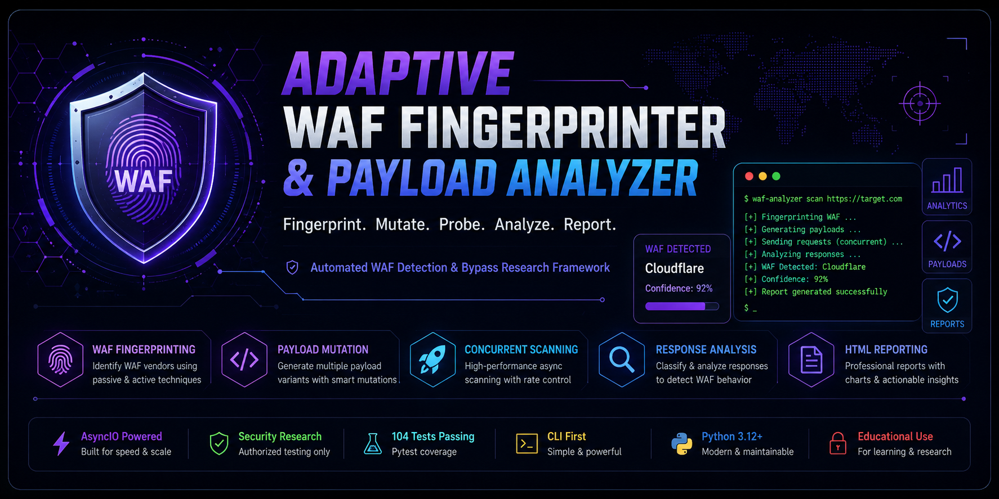
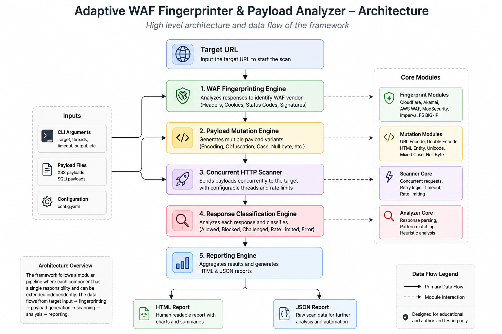
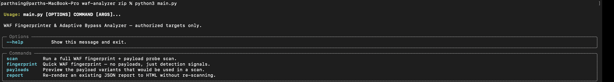
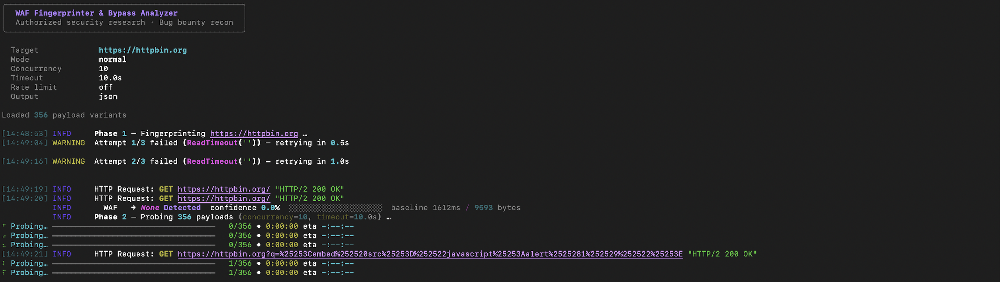
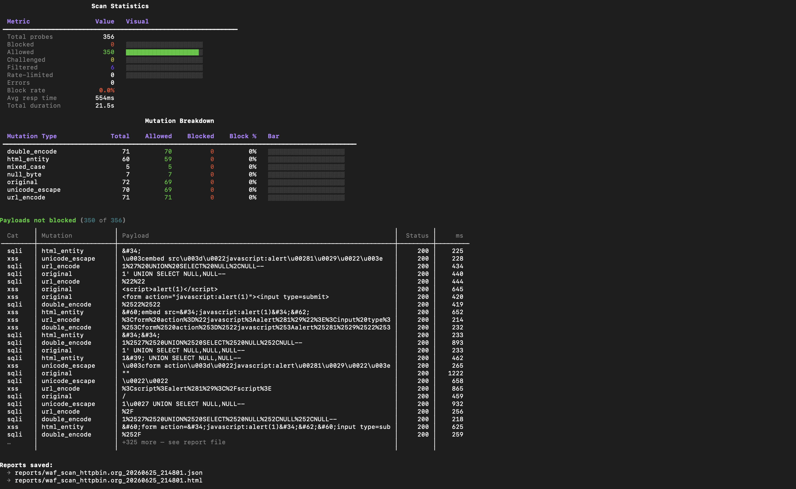
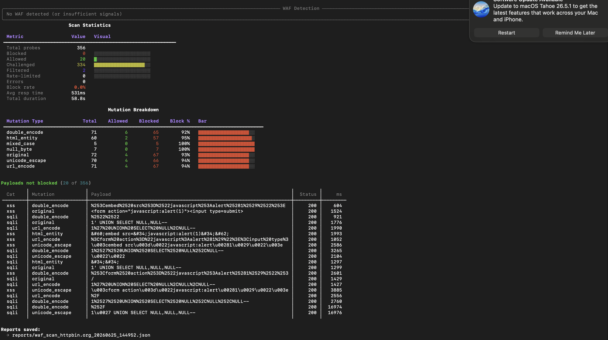

<p align="center">
  
</p>

<h1 align="center">🛡️ Adaptive WAF Fingerprinter & Payload Analyzer</h1>

<p align="center">
A production-inspired Python framework for WAF fingerprinting, payload mutation, concurrent probing,
response classification, and professional reporting.
</p>

<p align="center">


</p>
---

## Why I Built This

While learning Web Application Security through PortSwigger Web Security Academy, I became curious about what happens **between sending a payload and receiving a response**.

Instead of treating a Web Application Firewall as a black box, I wanted to understand:

- How different WAFs identify malicious requests
- How encoding and payload mutations affect detection
- How HTTP responses reveal filtering behaviour
- How repetitive testing could be automated

This project became a way to combine those concepts into a practical security tool.

Rather than manually sending hundreds of payloads, the framework automates fingerprinting, payload mutation, concurrent probing, response analysis, and report generation to help understand WAF behaviour in authorised security assessments.

> **Disclaimer:** This project is intended for educational purposes and authorised security testing only.
---

# ✨ Project Highlights

<table>
<tr>
<td width="50%">

### 🔍 WAF Fingerprinting

- Passive fingerprinting
- Header analysis
- Cookie analysis
- Status code detection
- Vendor identification

</td>

<td width="50%">

### ⚡ Payload Engine

- 356 Payload Variants
- XSS Mutations
- SQLi Mutations
- Encoding Techniques
- Adaptive Payload Generation

</td>
</tr>

<tr>
<td>

### 📊 Reporting

- HTML Reports
- JSON Reports
- Scan Statistics
- Mutation Breakdown
- Response Summary

</td>

<td>

### 🚀 Scanner

- Concurrent Requests
- Configurable Threads
- Timeout Control
- Rate Limiting
- CLI Interface

</td>
</tr>
</table>

---

## 📈 At a Glance

| Capability | Status |
|------------|--------|
| Modular Architecture | ✅ |
| Vendor Fingerprinting | ✅ |
| Payload Mutation Engine | ✅ |
| Concurrent Scanner | ✅ |
| HTML Reports | ✅ |
| JSON Reports | ✅ |
| Automated Tests | ✅ 104 Passing |
| Configurable CLI | ✅ |
---

# 🏗️ Architecture

The framework follows a modular pipeline where each stage performs a dedicated task, allowing new fingerprint modules, payload encoders, and reporting engines to be added independently.

<p align="center">
  
</p>

---
---

# ⚙️ How It Works

```text
Target URL
     │
     ▼
Fingerprint Detection
     │
     ▼
Payload Generation
(356 Mutated Payloads)
     │
     ▼
Concurrent Scanner
(Async HTTP Requests)
     │
     ▼
Response Analyzer
(Status • Headers • Body • Timing)
     │
     ▼
Vendor Classification
     │
     ▼
HTML / JSON Report
```

This modular workflow allows every stage to be extended independently, making it easy to add new fingerprint modules, payload mutation strategies, response analyzers, and reporting formats.

---
# ✨ Features

## 🔍 WAF Fingerprinting
- Detects Web Application Firewalls
- Current Support:
  - Akamai
- Signature-based detection
- Header analysis
- Response behaviour analysis

---

## 💣 Payload Mutation Engine

- 356 payload variants
- SQL Injection payloads
- Cross Site Scripting payloads
- URL Encoding
- Unicode Encoding
- HTML Entity Encoding
- Double Encoding
- Adaptive payload generation

---

## ⚡ Concurrent Scanner

- Async HTTP requests
- Configurable threads
- Timeout support
- Rate limiting
- Progress tracking

---

## 📊 Reporting

- HTML Report
- JSON Report
- Response Statistics
- Mutation Statistics
- Fingerprinting Summary

---

```
# 🚀 Usage

The scanner is designed to be simple and flexible. It supports multiple command-line options for fingerprinting, payload mutation, concurrency control, timeout configuration, and report generation.

## Basic Scan

```bash
python main.py -u https://example.com
```

---

## XSS Payload Scan

```bash
python main.py -u https://example.com -m xss
```

---

## SQL Injection Payload Scan

```bash
python main.py -u https://example.com -m sqli
```

---

## Increase Concurrent Requests

```bash
python main.py -u https://example.com -c 20
```

---

## Set Request Timeout

```bash
python main.py -u https://example.com -t 10
```

---

## Generate HTML Report

```bash
python main.py -u https://example.com -r html
```

---

## Save Scan Results

```bash
python main.py -u https://example.com -o reports/
```

---

## Combine Multiple Options

```bash
python main.py \
-u https://example.com \
-m xss \
-c 20 \
-t 10 \
-r html \
-o reports/
```

---

## Available CLI Options

| Option | Description |
|---------|-------------|
| `-u` | Target URL |
| `-m` | Payload type (XSS / SQLi) |
| `-c` | Number of concurrent requests |
| `-t` | Request timeout |
| `-r` | Report format |
| `-o` | Output directory |
---

# 📸 Screenshots

## 🏗️ Architecture

The framework follows a modular pipeline consisting of fingerprinting, payload generation, concurrent scanning, response analysis, and report generation.

<p align="center">
  
</p>

---

## 💻 CLI Overview

The project provides a simple command-line interface with dedicated commands for scanning, fingerprinting, payload preview, and report generation.

<p align="center">
  
</p>

---

## 🚀 Live Scan

Running a complete WAF fingerprinting and payload analysis against an authorized target.

<p align="center">
  
</p>

---

## 📊 Terminal Summary

Real-time scan statistics including payload execution, mutation breakdown, response classification, and scan metrics.

<p align="center">
  
</p>

---

## 📄 HTML Report

Automatically generated HTML report containing payload statistics, WAF detection results, charts, and detailed findings.

<p align="center">
  
</p>

---
# 📦 Installation

## Clone the Repository

```bash
git clone https://github.com/singhparth866/adaptive-waf-analyzer.git
```

## Navigate into the Project

```bash
cd adaptive-waf-analyzer
```

## Install Dependencies

```bash
pip install -r requirements.txt